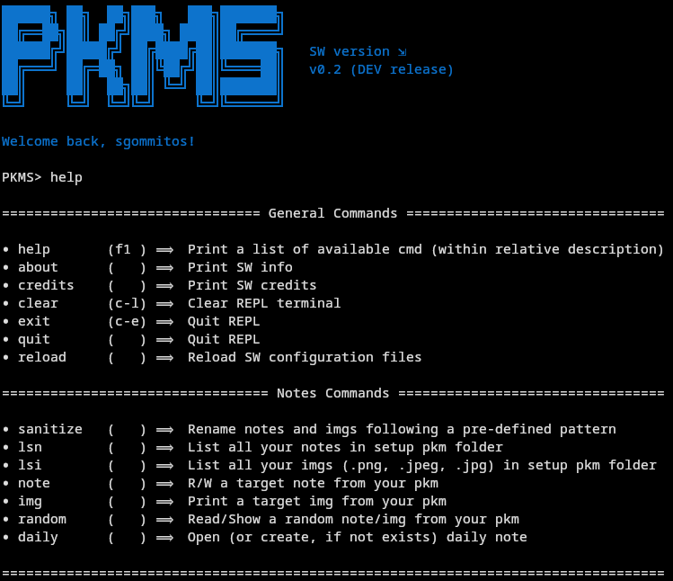

# README

> [!NOTE] 
> This SW is at the early stage of development ⟹ it could be affected by major changes.   
> Also, consider that it's developed as a side-project without any pretention, so the SW architecture will grow within time (and personal needs :P).   
> As i started these project during my holidays (i'm honestly writing this `README` next to the pool), i'm aware that i will need to enhanced project structure and logic.

## Introduction

`PKMS`, which stands for *Personal Knowledge Management System*, is a SW which consists in a REPL, used to handle user's PKM:

First thing first, this SW focused on `user-privacy` ⟹ **All data are stored into user PC**, and **no internet connection is required for local use**[^1] 

Talking about the other characteristics, the goal to achieve is to create a SW that is:

- Simple 
    - In terms of development: 
        - It should follow the *suckless* SW development philosophy
        - It should use as few external dependencies as possible (and, if used, FOSS)
    - In terms of usability: 
        - It should be as simple as possible for everybody, even if it's not used to use terminal
- Cross-Platform
    - It should run on the major OS (i.e: Linux, MacOS, Windows)
- User-Edit-Ready:
    - Everybody should be able to edit the code themselves. 

Due to that, `PKMS` will be (mainly)[^2] developed using Python.

## SW features

- `UTF-8` usage 

## How it works

TBI.

## Dependencies

### Python libraries

- [`python-prompt-toolkit`](https://github.com/prompt-toolkit/python-prompt-toolkit)
    - Used for:
        - Autocompletion
        - Commands History

## Implementation

### Planned

- [ ] Entire User-Data Folder Encryption
- [ ] [`rclone`](https://rclone.org/) integration

### Would be nice

- [ ] Single-file Encryption
- [ ] Community plugins
 

[^1]: Please check **implementation section** for cloud storage features.
[^2]: Some specific features could be implemented using low-level languages, such as `C`. This will be decided during the development of the project